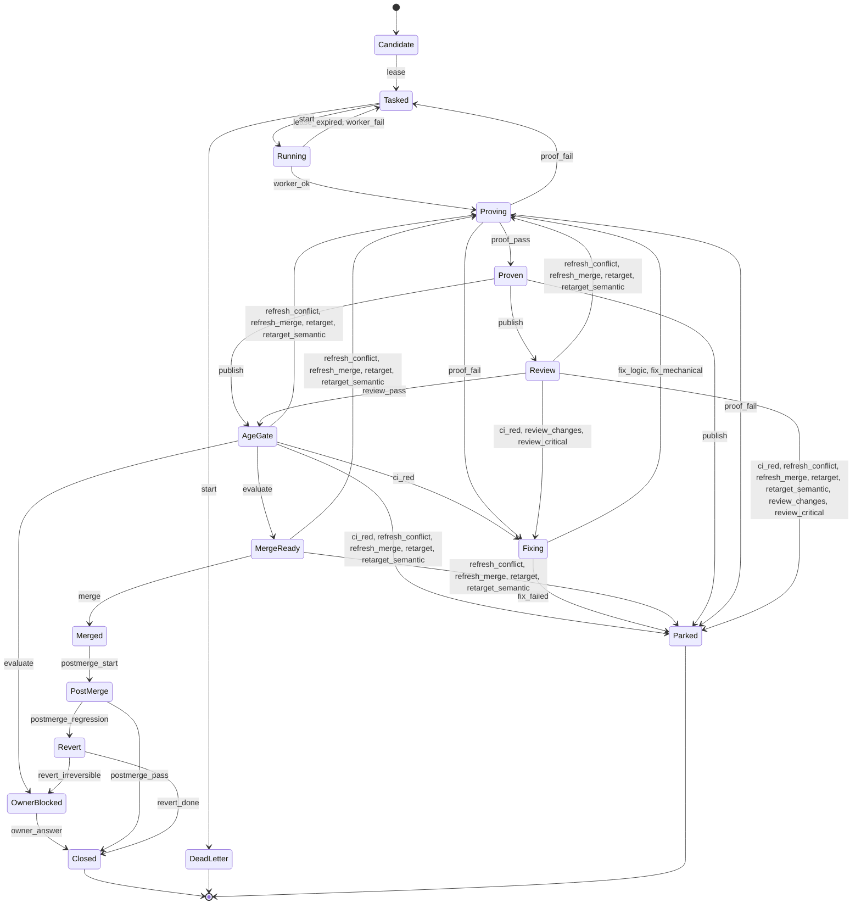

# Merge-gate model

Status: implemented, experimental, 2026-09-27. Tool: `scripts/merge_gate_model.py`.
For: the finite merge state machine in the private control plane (v3), and the estate laws
it must obey (`rules/laws.md` 2 and 11). Parent epic: [#299](https://github.com/Chris0Jeky/agent-harness/issues/299)
(a deterministic oracle that may gate; see [MERGE_BOUNDARY](MERGE_BOUNDARY.md)).

The merge gate is currently enforced by model instructions and coordinator prose. The research
behind #432 says it "should be encoded in software, not entrusted to model instructions". This
file is that encoding as an executable specification. It is a pure transition function
`step(state, event)` and an exhaustive checker that proves the laws hold on every reachable path.
The durable control plane imports nothing from here; it replays the conformance corpus instead.

## What `check` proves

For all four merge authorities (`free`, `gated`, `human-only`, `none`), every reachable state is
explored in product with an observer (below): 50,542 nodes, 153,356 transitions and 198 merge
edges at this commit, in about two seconds.

1. **No illegal merge.** Every merge edge satisfies `merge_violations`. Each of its rules needs
   two facts to agree: the observer's event-derived fact, and the table's evidence identity for
   the exact head, base or logic version. It requires:
   - authority `free`, and the PR published ready-for-review;
   - a proof and green CI for the exact `(head, base)` pair;
   - a review of the current logic version;
   - the head aged three minutes;
   - review rounds within the ceiling;
   - the merged SHA equal to the head.
2. **Review ceiling.** Rounds never exceed two, plus the single reopen that global law 2d grants a new
   CRITICAL introduced by fixes.
3. **Bounded counters.** Worker attempts are at most 3, fixes at most 3, base refreshes at most
   3, and review rounds as above. Counters are checked on every successor before terminal
   states are collapsed.
4. **No unbounded cycle.** Every strongly connected component of the non-terminal graph is a
   single state. Only state-preserving no-ops repeat, so every loop consumes a bounded counter.
5. **No trap.** Every reachable state can reach `Closed`, `Parked`, `DeadLetter` or the
   owner-decision state `OwnerBlocked`.
6. **Liveness.** `free` authority can reach a merge at all, so a table that routes everything
   to the owner cannot pass as "safe".

**The observer.** A table's own counters cannot be trusted to grade the table: an uncounted
review round, or an age that survives a push, would otherwise look lawful. The observer is a
small automaton driven only by the accepted event stream:
- review verdicts are counted, and a CRITICAL counts toward the reopen only when it is
  "introduced by the fixes" (global law 2d): after a first round, and with a fix since that round's
  verdict. A CRITICAL on a round that reviewed only a base change cannot reopen; the table
  refuses it too, so such a round can only pass or park;
- aging restarts when a head-changing event fires and again when that head is published, so a
  head never ages before its push;
- review is cleared by a logic-changing event;
- proof and CI are cleared by a head or base change.

It is bounded, so the product with the table stays finite. Two facts remain inputs rather than
observations: authority (configuration) and ready-for-review (a publish effect).

`check --all-mutants` proves that the checker has teeth. Sixteen seeded defects must each fail,
with the expected violation:
- `no_age_gate`, `stale_review`, `third_round` and `unbounded_fixes`;
- `merge_on_red`, `retarget_keeps_proof`, `gated_merges` and `draft_merge`;
- `age_kept_on_push`, `uncounted_review`, `changes_reopen` and `conflict_keeps_review`;
- `semantic_retarget_keeps_review`, `early_critical`, `tick_before_push` and `unfixed_critical`.

The third group are bookkeeping slips that the first version of this checker certified as
lawful. A fresh-context review found them, and the observer now catches them. The last group
came from the second review round (#359) and the review of its fix (#361). Each fails only because
of the observer rule it pins; removing that rule lets the mutant through, which was checked for
`tick_before_push` and `unfixed_critical`.

A new invariant belongs with a mutant it catches.

**The abstraction.** Heads, bases and logic versions only increase, so evidence for an older one
can never become current again. The checker therefore stores each evidence identity as current
or stale, which is what makes the graph finite. A test replays seeded random walks, with and
without each mutant, so it samples states rather than checking every one. It asserts two things: the abstraction never changes a spec verdict, and
`canonical(step(s, e)) == canonical(step(canonical(s), e))` for every event. The second is the
property the exhaustive search relies on.

## Rules the checker forced into the open

Writing the laws as a machine surfaced cases the prose leaves implicit:

- **Unreviewable logic parks.** Suppose round 1 requests changes, round 2 passes, and CI then
  goes red. A fix that changes logic would need a third review, which global law 2d forbids, so
  publishing it parks the PR. A *mechanical* fix keeps the review and can still ship. The first
  run of the checker found this path as a ceiling violation.
- **Retarget versus refresh.** A retarget moves the base under the same head. It needs fresh
  proof and CI, but it keeps the review and the aging clock (paused while the new base is
  re-proved, which only delays a lawful merge). A merge-commit refresh is a new
  pushed head, so its aging restarts (global law 2f). It keeps the review *unless* the new base brings
  a conflict, semantic interaction or new logic: global law 2g's exception is the `refresh_conflict`
  event. Such a refresh after the last round parks. A retarget whose new base interacts
  semantically with the change (`retarget_semantic`) likewise owes a fresh review, while the
  head, and so its aging clock, stays.
- **Base churn must be bounded.** Without a refresh counter, "base moved, re-prove" is an
  unbounded cycle. The model parks after three refreshes. The laws name no such bound; the
  control plane should adopt one or name its own.
- **"A third review round is structurally impossible"** (a #432 qualification canary) is
  true except for global law 2d's one CRITICAL reopen. The model follows the law: the third round
  exists only through that reopen, and a second reopen parks.
- **Non-free authority never merges autonomously.** `gated`, `human-only` and `none` reach
  `OwnerBlocked` with every proof in hand, so the owner's decision is the only exit.

## Conformance corpus

`traces --count N --seed S [--authority A]` emits seeded random walks as JSONL: the event list,
the phase reached after each event, the events the model refuses in each state along the way
(including the final one), and the final state. An implementation of the gate (the #432 DBOS
workflow, or an EstateGate `merge_exact_head` precondition) passes when it replays every trace
to the same phases and final counters, and refuses every listed event at its step. The refusals
make a permissive implementation fail, not only a strict one. The corpus is data; the
implementation owns its own storage and effects.

## Diagram

Generated by `py -3 scripts/merge_gate_model.py diagram` (phase level; the counters are not
drawn).

## Deliberately conservative

- **One fix budget per PR, not per red check.** Review-driven, proof-driven and CI-driven fixes
  share the three attempts. The law bounds attempts at a red check; the model parks sooner,
  never later.
- **A mechanical fix to requested changes still costs a review round.** Requested changes are
  not a review of the fixed code, so the fix is reviewed. This spends throughput to keep
  "reviewed" meaning reviewed.

## Limits

- It models decisions, not effects. GitHub, CI and review are events. Whether a review was
  genuinely independent, or a fix genuinely "mechanical", is an input the implementation must
  establish.
- One PR at a time. Stacked-PR ordering (global law 4), post-merge late-comment reconciliation (global law 2h)
  and cross-PR interference are not modelled.
- The bounds are the laws' where the laws name one. The refresh bound and the dead-letter
  attempt count are this model's proposals.
