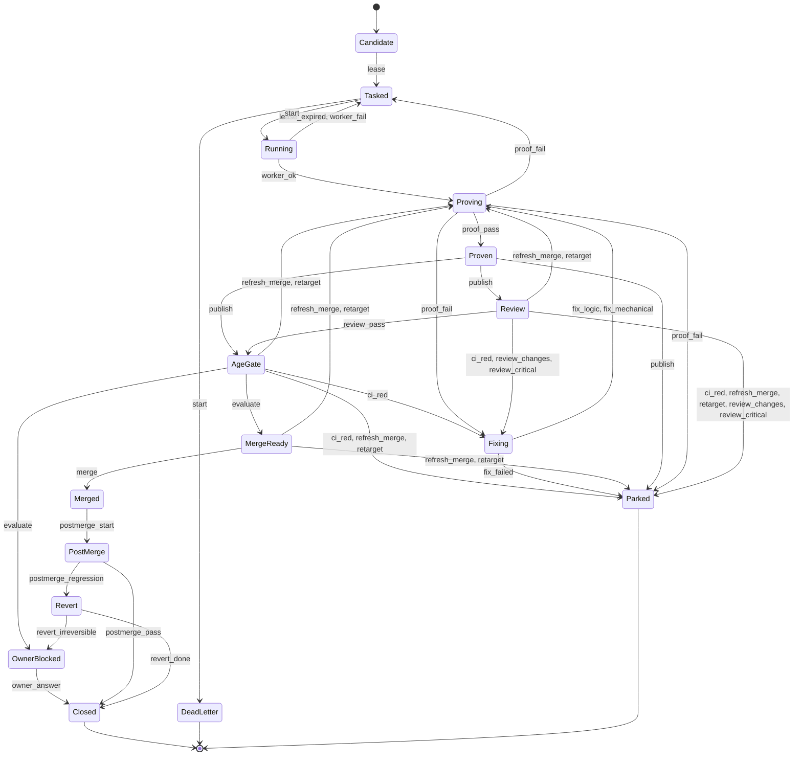

# Merge-gate model

Status: implemented, experimental, 2026-09-27. Tool: `scripts/merge_gate_model.py`.
For: the finite merge state machine in claude-config #432 (control plane v3), and the estate laws
it must obey (`rules/laws.md` 2 and 11). Parent epic: [#299](https://github.com/Chris0Jeky/agent-harness/issues/299)
(a deterministic oracle that may gate; see [MERGE_BOUNDARY](MERGE_BOUNDARY.md)).

The merge gate is currently enforced by model instructions and coordinator prose. The research
behind #432 says it "should be encoded in software, not entrusted to model instructions". This
file is that encoding as an executable specification. It is a pure transition function
`step(state, event)` and an exhaustive checker that proves the laws hold on every reachable path.
The durable control plane imports nothing from here; it replays the conformance corpus instead.

## What `check` proves

For all four merge authorities (`free`, `gated`, `human-only`, `none`), every reachable state is
explored: 28,965 states, 80,636 transitions and 108 merge edges at this commit, in about two
seconds.

1. **No illegal merge.** Every merge edge satisfies `merge_violations`, a spec written
   independently of the transition table's bookkeeping flags. It requires:
   - authority `free`, and the PR published ready-for-review;
   - a proof and green CI for the exact `(head, base)` pair;
   - a review of the current logic version;
   - the head aged three minutes;
   - review rounds within the ceiling;
   - the merged SHA equal to the head.
2. **Review ceiling.** Rounds never exceed two, plus the single reopen that law 2d grants a new
   CRITICAL introduced by fixes.
3. **Bounded counters.** Worker attempts are at most 3, fixes at most 3 (law 11's three
   genuinely different attempts), base refreshes at most 3, and review rounds as above.
4. **No unbounded cycle.** Every strongly connected component of the non-terminal graph is a
   single state. Only state-preserving no-ops repeat, so every loop consumes a bounded counter.
5. **No trap.** Every reachable state can reach `Closed`, `Parked`, `DeadLetter` or the
   owner-decision state `OwnerBlocked`.

`check --all-mutants` proves that the checker has teeth. Eight seeded defects must each fail,
with the expected violation:
- `no_age_gate`, `stale_review`, `third_round` and `unbounded_fixes`;
- `merge_on_red`, `retarget_keeps_proof`, `gated_merges` and `draft_merge`.

A new invariant belongs with a mutant it catches.

**The abstraction.** Heads, bases and logic versions only increase, so evidence for an older one
can never become current again. The checker therefore stores each evidence identity as current
or stale, which is what makes the graph finite. A test replays seeded random walks, with and
without each mutant, and asserts that the abstraction never changes any spec verdict.

## Rules the checker forced into the open

Writing the laws as a machine surfaced cases the prose leaves implicit:

- **Unreviewable logic parks.** Suppose round 1 requests changes, round 2 passes, and CI then
  goes red. A fix that changes logic would need a third review, which law 2d forbids, so
  publishing it parks the PR. A *mechanical* fix keeps the review and can still ship. The first
  run of the checker found this path as a ceiling violation.
- **Retarget versus refresh.** A retarget moves the base under the same head. It needs fresh
  proof and CI, but it keeps the review and the aging clock. A merge-commit refresh is a new
  pushed head: it keeps the review (no logic change), and its aging restarts (law 2f).
- **Base churn must be bounded.** Without a refresh counter, "base moved, re-prove" is an
  unbounded cycle. The model parks after three refreshes. The laws name no such bound; the
  control plane should adopt one or name its own.
- **"A third review round is structurally impossible"** (a #432 qualification canary) is
  true except for law 2d's one CRITICAL reopen. The model follows the law: the third round
  exists only through that reopen, and a second reopen parks.
- **Non-free authority never merges autonomously.** `gated`, `human-only` and `none` reach
  `OwnerBlocked` with every proof in hand, so the owner's decision is the only exit.

## Conformance corpus

`traces --count N --seed S [--authority A]` emits seeded random walks as JSONL: the event list
plus the final state. An implementation of the gate (the #432 DBOS workflow, or an EstateGate
`merge_exact_head` precondition) passes when it replays every trace to the same final phase and
counters, and when it refuses every event this model does not enable. The corpus is data; the
implementation owns its own storage and effects.

## Diagram

Generated by `py -3 scripts/merge_gate_model.py diagram` (phase level; the counters are not
drawn).

## Limits

- It models decisions, not effects. GitHub, CI and review are events. Whether a review was
  genuinely independent, or a fix genuinely "mechanical", is an input the implementation must
  establish.
- One PR at a time. Stacked-PR ordering (law 4), post-merge late-comment reconciliation (law 2h)
  and cross-PR interference are not modelled.
- The bounds are the laws' where the laws name one. The refresh bound and the dead-letter
  attempt count are this model's proposals.
